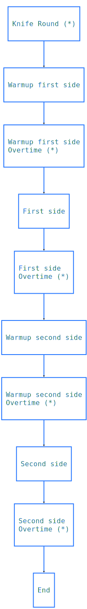

# CS:GO lore

## Match Flow

**(*)** means the designated stage can be disabled.

## Knife round

An additional round at the start with only knifes. The winning team gets to decide the starting side (CT/T) of each team. It can be enabled or disabled during match configuration.

## Overtime

If both teams win an equal number of rounds (15-15 in standard competition), an overtime can be launched. It's a best of 6, first to get to 19 wins, if teams get tie again (18-18), overtime is relaunched. Overtime can be disabled during match config, in which case the match ends on a tie.

## Links

https://www.hotspawn.com/csgo/guides/a-beginners-guide-to-csgo-maps
https://bitspawn.gg/how-to-play-csgo-beginners-guide/
https://github.com/deStrO/eBot-CSGO/wiki/Full-documentation
