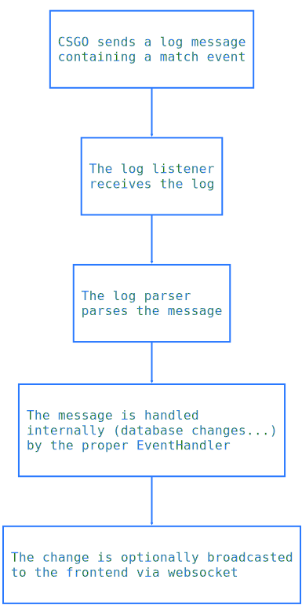

# CS:GO Logs

## Background

To supervise a match and show stats, confinebot needs to have access to realtime events (kills, hits, bomb events...) of the match. CS:GO is able to broadcast these information to a specified host using different means (HTTP POST or plain UDP). These log messages will be sent to the host specified in the `logaddress_add` command (see [the cvar reference](https://developer.valvesoftware.com/wiki/List_of_CS:GO_Cvars)) that needs to be issued via RCON.

Example of how log handling is done in eBot : https://github.com/deStrO/eBot-CSGO/blob/master/src/eBot/Match/Match.php#L170

## Implementation

### Event handling overview

### Technical details

* We chose to use plain UDP for log transport, mainly to avoid performance issues both in the CSGO server and the listening component in the confinebot
* For the moment, confinebot log protocol allocates one port per match for the log listener. We might by able to multiplex and use a single port for all matches using either `logaddress_add_ex` or `logaddress_add_ts` commands that add a unique header per match in each message. The difficulty is that this header is not predictible (to the best of our knowledge) which makes the *one port per match* method easier to implement. Honestly, if we ever find how to multiplex, we might not consider it for production as CS:GO server litterally floods the channel with messages, using a single port might create lag or even message loss (as it is udp).

### TBD
* [ ] create needed event handlers
* [ ] add a websocket server and redirect events 
